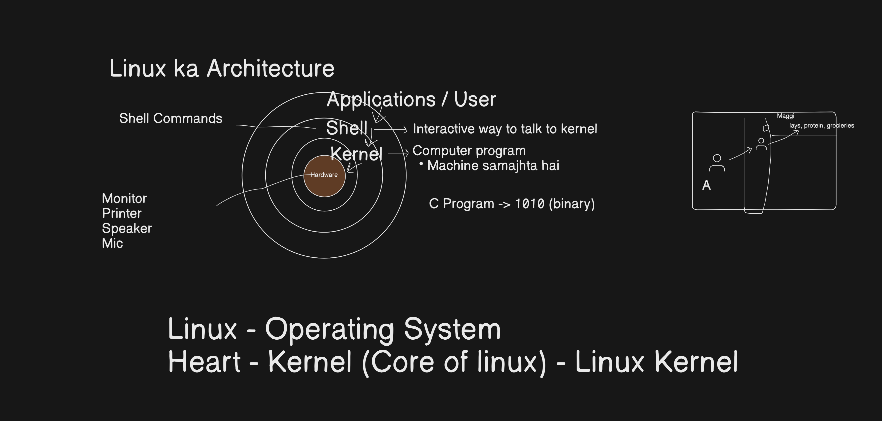
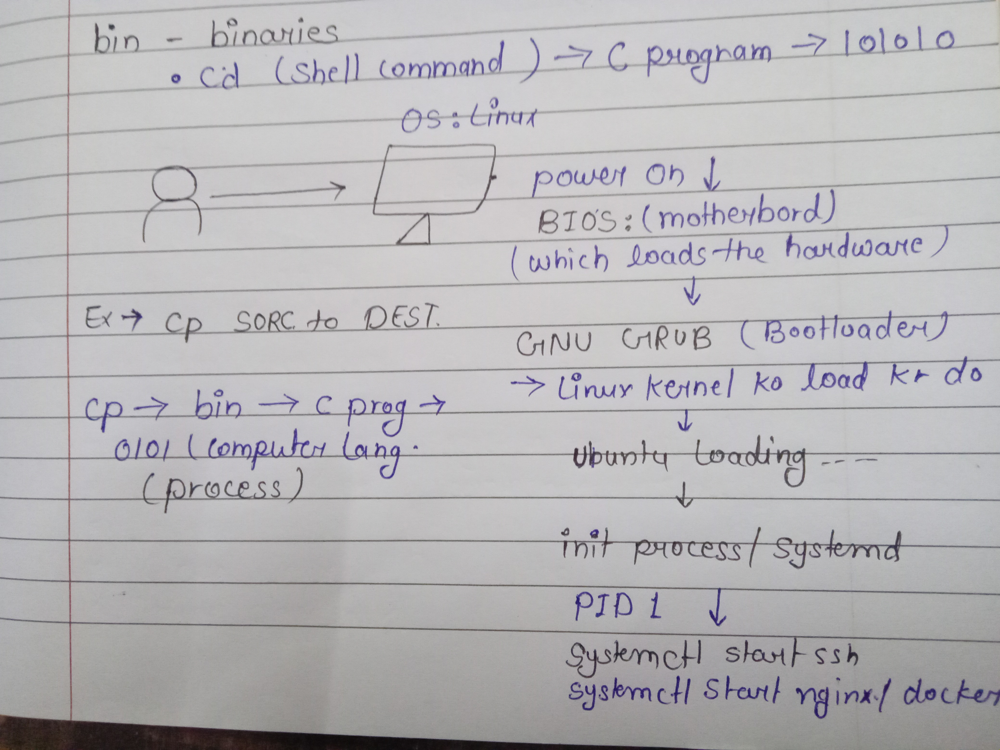

# Linux Architecture, Processes and Systemd

# 1. Linux Architecture

## Basic Architecture

Application → Shell → Kernel → Hardware

  

## Technically Better Model

User Space ↔ System Call Interface ↔ Kernel Space ↔ Hardware

                    LINUX 
                     │ 
           ┌─────────┴─────────┐
           ↓                   ↓
      USER SPACE          KERNEL SPACE 
           │                   │ 
           └──── System Calls ─┘ 
                    │  
                    ↓
                 Hardware

                    Linux
                      │
        ┌─────────────┴─────────────┐
        │                           │
    USER SPACE                 KERNEL SPACE
        │                           │
    systemd                        Kernel
        │                           │
    Services                  Process management
    nginx                       Memory management
    sshd                        Filesystem
    Docker                      Networking

Here, space refers to a protected area of memory and execution privileges provided by the operating system.

## User Space:

The area where user-level applications, shells, system utilities, services, and libraries run with restricted privileges.

`Examples: bash, ls, python, nginx, docker `

User-space programs cannot directly access hardware or kernel memory. They request kernel services through system calls.

## Kernel Space:

The privileged area where the Linux kernel runs and manages system resources.

Main responsibilities:
  - Process Management → CPU scheduling, multitasking, IPC
  - Memory Management → allocation, virtual memory, paging, swapping
  - File System Management → VFS and filesystem operations
  - Device Management → device drivers and hardware communication
  - Networking → TCP/IP, sockets, routing
  - Security → permissions, access control, SELinux

## System Call

A system call is a controlled interface through which a user-space program requests a service from the Linux kernel.

`Examples:
open()
read()
write()
close()
fork()
exec()`

# Processes

## Process Creation

As we power on our system firstly BIOS loads the hardwares. BIOS is a pre-installed firamware on motherboad that is initialize the hardwares and perform POST(Power-On-Self-Test). Then GNU GRUB(grand Unified Bootloader) is a software that is load the operating system and our system starts to run. As soon as system runs the first process to run is systemd/init PID 1 and systemctl is controller that are attached with the process.  

Kernel is a machine that works on binary language we can't directly interact with that. so for communicate with the Kernel we have to give the instrucation to Shell and the talk with kernel. 
The kernel runs in privileged mode and provides controlled services to user-space programs through system calls.

When the system starts, the first process that runs On systems using systemd, systemd runs as PID 1. and along with it, the systemctl command is used to control and manage all system processes."

  

## Process Management Commands: 

| Command   | Purpose                                       | Example                 |
| --------- | --------------------------------------------- | ----------------------- |
| `ps`      | Display running processes                     | `ps`                    |
| `ps -ef`  | Show all running processes with details       | `ps -ef`                |
| `ps aux`  | Display all processes with CPU & memory usage | `ps aux`                |
| `top`     | View running processes in real time           | `top`                   |
| `htop`    | Interactive process viewer                    | `htop`                  |
| `pidof`   | Find the PID of a process                     | `pidof sshd`            |
| `pgrep`   | Search process by name                        | `pgrep nginx`           |
| `kill`    | Terminate a process by PID                    | `kill 1234`             |
| `kill -9` | Forcefully terminate a process                | `kill -9 1234`          |
| `pkill`   | Kill process by name                          | `pkill firefox`         |
| `killall` | Kill all instances of a process               | `killall chrome`        |
| `jobs`    | Show background jobs                          | `jobs`                  |
| `bg`      | Resume a stopped job in the background        | `bg %1`                 |
| `fg`      | Bring a background job to the foreground      | `fg %1`                 |
| `nohup`   | Run a process even after logout               | `nohup python app.py &` |
| `nice`    | Start a process with a priority               | `nice -n 10 command`    |
| `renice`  | Change priority of a running process          | `renice 5 -p 1234`      |

## Process State

🟢 R – Running  
🟡 S – Interruptible Sleep (waiting for an event)  
🟠 D – Uninterruptible Sleep (usually waiting for disk I/O)  
🔴 T – Stopped or traced  
⚫ Z – Zombie (The process has finished execution, but its parent process hasn't collected its exit status yet.)  

A zombie:  
- Uses almost no CPU or memory.  
- Keeps a PID until it's cleaned up.

# 3. Systemd

`systemd` is the system and service manager used by many modern Linux distributions.

After the kernel initializes the system, `systemd` normally starts as the first user-space process:

Main responsibilities:

Starts services during boot
Stops and restarts services
Manages service dependencies
Monitors services
Manages system targets
Handles logging through `journald` (when configured)

`systemd` → Actual system/service manager (PID 1) 
systemctl → Command-line tool used to control `systemd`

Example: 
systemctl status nginx  
systemctl start nginx  

